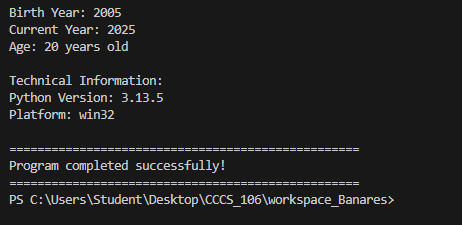
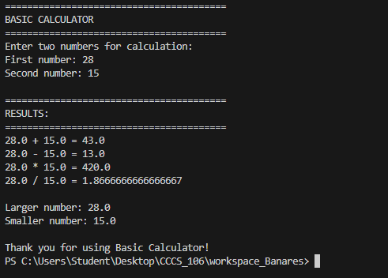
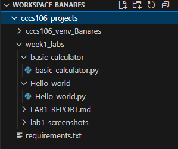
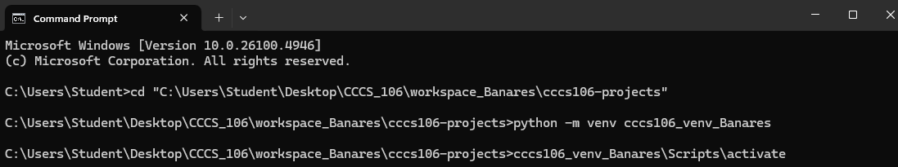

# Lab 1 Report: Environment Setup and Python Basics

**Student Name:** JOHN KENNETH MATA BANARES
**Student ID:** 231000041
**Section:** BSCS-3B
**Date:** SEPTEMBER 3, 2025

## Environment Setup

### Python Installation
- **Python Version:** 3.13.5
- **Installation Issues:** nothing
- **Virtual Environment Created:** ✅ cccs106_env_lastname

### VS Code Configuration
- **VS Code Version:** 1.103.2
- **Python Extension:** ✅ Installed and configured
- **Interpreter:** ✅ Set to cccs106_env_lastname/Scripts/python.exe

### Package Installation
- **Flet Version:** 0.28.3
- **Other Packages:** List any additional packages

## Programs Created

### 1. hello_world.py
- **Status:** ✅ Completed
- **Features:** Student info display, age calculation, system info
- **Notes:** nothing

### 2. basic_calculator.py
- **Status:** ✅ Completed
- **Features:** Basic arithmetic, error handling, min/max calculation
- **Notes:** always think of two seperate number

## Challenges and Solutions

It will make your head dizzy and you have to make sure everything is correct.

## Learning Outcomes

I have gained more new knowledge about python versions, how to create a environment and many more that I can use in my future endeavor.

## Screenshots

